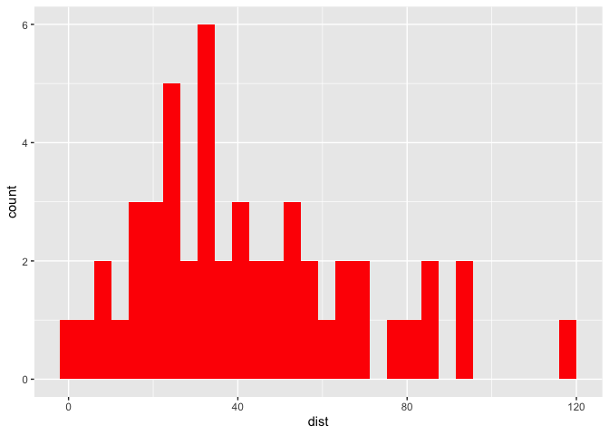

  - [Part 0. Proposal](#part-0-proposal)
  - [Part I. Work out functionality 🚧
    ✅](#part-i-work-out-functionality--)
      - [Try it out](#try-it-out)
  - [Part II. Packaging and documentation 🚧
    ✅](#part-ii-packaging-and-documentation--)
      - [Phase 1. Minimal working
        package](#phase-1-minimal-working-package)
      - [Phase 2: Listen & iterate 🚧 ✅](#phase-2-listen--iterate--)
      - [Phase 3: Settling and testing 🚧
        ✅](#phase-3-settling-and-testing--)
      - [Phase 4. Promote to wider audience… 🚧
        ✅](#phase-4-promote-to-wider-audience--)
      - [Phase 5: Harden/commit: Submit to CRAN/RUniverse 🚧
        ✅](#phase-5-hardencommit-submit-to-cranruniverse--)
  - [Appendix: Reports, Environment](#appendix-reports-environment)
      - [Description file complete? 🚧 ✅](#description-file-complete--)
      - [Environment 🚧 ✅](#environment--)
      - [`devtools::check()` report](#devtoolscheck-report)
      - [Package directory file tree](#package-directory-file-tree)

<!-- badges: start -->

[](https://lifecycle.r-lib.org/articles/stages.html#experimental)
<!-- badges: end -->

# Part 0. Proposal

Proposing the {magenta.histogram} package\! 🦄
<!-- (typical package introduction write up; but actually aspirational) -->

The goal of {magenta.histogram} is to make … easier.

Without the package, we live in the effort-ful world that follows 🏋:

``` r
library(ggplot2)

ggplot(data = cars, aes(x = dist)) + 
  geom_histogram(fill = "red")
#> `stat_bin()` using `bins = 30`. Pick better value with `binwidth`.
```

<!-- -->

With the {magenta.histogram} package, we’ll live in a different world (🦄
🦄 🦄) where the task is a snap 🫰:

Proposed API:

``` 

library(ggplot2)
library(magenta.histogram)

ggplot(data = cars, aes(x = dist)) + 
  geom_histogram_red()


```

# Part I. Work out functionality 🚧 ✅

Here is a function that will do some work…

``` r
geom_histogram_red <- function(...){
  
  ggplot2::geom_histogram(fill = "red", ...)
  
  
}
```

## Try it out

``` r
ggplot(cars, aes(dist)) + 
  geom_histogram_red()
#> `stat_bin()` using `bins = 30`. Pick better value with `binwidth`.
```

<!-- -->

# Part II. Packaging and documentation 🚧 ✅

## Phase 1. Minimal working package

### Bit A. Created package archetecture, running `devtools::create(".")` in interactive session. 🚧 ✅

``` r
devtools::create(".")
```

### Bit B. Managing [dependencies](https://r-pkgs.org/dependencies-in-practice.html) if they exist 🚧 ✅

Dependencies – use of non-base R functions within your function – must
be declared in your package.

This means …

1.  you’ll use the `::` notation, e.g. `package::function()` in your
    functions when you use another package’s functions.  
2.  you’ll document package dependencies to your DESCRIPTION file – this
    can be done automatically with `usethis::use_package`, the example
    is the case where ggplot2 is a dependency:

<!-- end list -->

``` r
usethis::use_package("ggplot2")
```

### Bit C. Moved functions [R code folder](https://r-pkgs.org/code.html)? 🚧 ✅

Use new {readme2pkg} function to do this from readme…

``` r
readme2pkg::chunk_to_r(chunk_name = "geom_histogram_red")
```

### Bit D. Run [`devtools::check()`](https://r-pkgs.org/whole-game.html#check) and address errors. 🚧 ✅

``` r
devtools::check(pkg = ".")
```

devtools check will document the functions for you.

### Bit E. [Install](https://r-pkgs.org/whole-game.html#install) and restart your brand new package\!\! 🚧 ✅

``` r
devtools::install(pkg = ".", upgrade = "never")
```

### Bit F. Write traditional README that uses built package (also serves as a test of build). 🚧 ✅

The goal of the {magenta.histogram} package is to …

Install package with:

    remotes::install_github("EvaMaeRey/magenta.histogram")

Once functions are exported you can remove go to two colons, and when
things are are really finalized, then go without colons (and rearrange
your readme…)

``` r
library(magenta.histogram)  ##<< change to your package name here
ggplot(cars, aes(x = dist)) + 
  magenta.histogram:::geom_histogram_red()
```

### Bit G. Add [lifecycle badge](https://r-pkgs.org/lifecycle.html) (experimental) 🚧 ✅

``` r
usethis::use_lifecycle_badge("experimental")
```

### Bit H. Compile README.Rmd 🚧 ✅

### Bit I. Push to github. 🚧 ✅

RStudio: Console/Terminal/RMarkdown/Jobs:

Terminal -\> git add . -\> git commit -m “first commit” -\> git push

## Phase 2: Listen & iterate 🚧 ✅

Try to get feedback from experts on API, implementation, default
decisions, names. Is there already work that solves this problem?

> “Hey Jordan, I know you are an expert in multiplication methods. I was
> wondering if you’d have a look at the motivation and functionality in
> my development {times.two} package found at
> github.com/myusername/times.two”

> “Hey Ella, I know you’ve done great worked on {times.three}. I think
> my new project does something similar in terms API. I was wondering if
> you’d have a look at the implementation. Code can be found in
> github.com/myusername/times.two”

## Phase 3: Settling and testing 🚧 ✅

In this phase you should start settling on function and argument names,
decide which ones will be exported, and make those functions more robust
and usable with examples, tests, messages and warnings.

### Bit A. Added a description and author information in the [DESCRIPTION file](https://r-pkgs.org/description.html) 🚧 ✅

### Bit B. Added [roxygen skeleton](https://r-pkgs.org/man.html)? 🚧 ✅

Use a roxygen skeleton for auto documentation and making sure proposed
functions are *exported*. (in RStudio ’Code -\> insert Roxygen Skeleton)
Generally, early on, I don’t do much (anything) in terms of filling in
the skeleton for documentation, because things may change.

### Bit C. Chosen a [license](https://r-pkgs.org/license.html)? 🚧 ✅

``` r
usethis::use_mit_license()
```

### Bit D. Settle on [examples](https://r-pkgs.org/man.html#sec-man-examples). Put them in the roxygen skeleton and readme. 🚧 ✅

### Bit E. Written formal [tests](https://r-pkgs.org/testing-basics.html) of functions and save to test that folders 🚧 ✅

That would look like this…

``` r
library(testthat)

test_that("calc times 2 works", {
  expect_equal(times_two(4), 8)
  expect_equal(times_two(5), 10)
  
})
```

``` r
readme2pkg::chunk_to_tests_testthat("test_calc_times_two_works")
```

### Bit F. Check again. Addressed notes, warnings and errors. 🚧 ✅

``` r
devtools::check(pkg = ".")
```

## Phase 4. Promote to wider audience… 🚧 ✅

### Bit A. Package website built? 🚧 ✅

### Bit B. Package website deployed? 🚧 ✅

## Phase 5: Harden/commit: Submit to CRAN/RUniverse 🚧 ✅

# Appendix: Reports, Environment

## Description file complete? 🚧 ✅

``` r
readLines("DESCRIPTION")
```

## Environment 🚧 ✅

Here I just want to print the packages and the versions

``` r
all <- sessionInfo() |> print() |> capture.output()
all[11:17]
#> [1] ""                                                                         
#> [2] "attached base packages:"                                                  
#> [3] "[1] stats     graphics  grDevices utils     datasets  methods   base     "
#> [4] ""                                                                         
#> [5] "other attached packages:"                                                 
#> [6] "[1] ggplot2_3.4.4.9000"                                                   
#> [7] ""
```

## `devtools::check()` report

``` r
devtools::check(pkg = ".")
```

## Package directory file tree

``` r
fs::dir_tree(recurse = T)
#> .
#> ├── DESCRIPTION
#> ├── NAMESPACE
#> ├── R
#> │   └── geom_histogram_red.R
#> ├── README.Rmd
#> ├── README.md
#> ├── README_files
#> │   └── figure-gfm
#> │       ├── unnamed-chunk-2-1.png
#> │       └── unnamed-chunk-3-1.png
#> ├── magenta.histogram.Rproj
#> └── man
```
